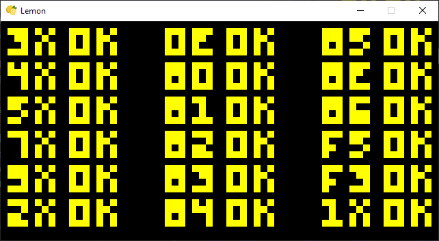

<h1 align="center">

 Lemon.pie
</h1>

Lemon is a **[CHIP-8](https://en.wikipedia.org/wiki/CHIP-8)** Emulator written in Python using Pygame.
This library aims at implementing the original and classic varient of CHIP-8 Virtual Machine. Currently a Work in Progress.

This project is the successor of my very first implementation of the VM (Now archived) Trace-Fractal.

## Screenshots

### IBM Logo:

### Corax Test:

## Resources:
- [Cowgod's Chip-8 Technical Reference v1.0](http://devernay.free.fr/hacks/chip8/C8TECH10.HTM)
- [Tobias' Guide](https://tobiasvl.github.io/blog/write-a-chip-8-emulator/)
