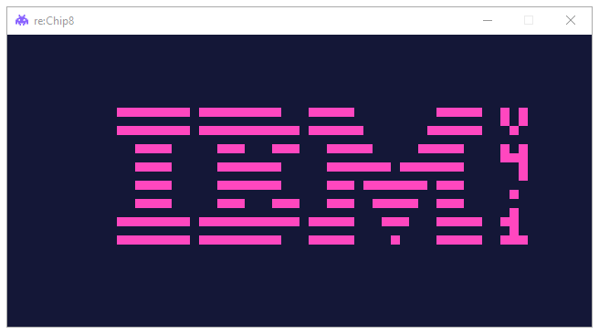
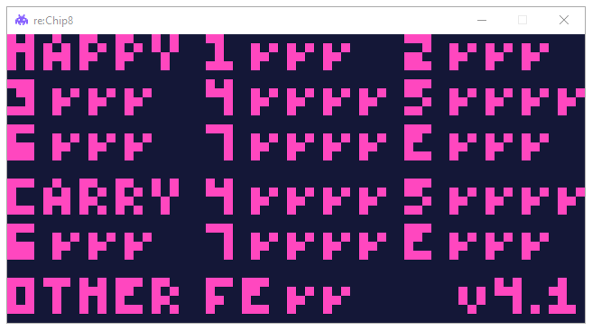
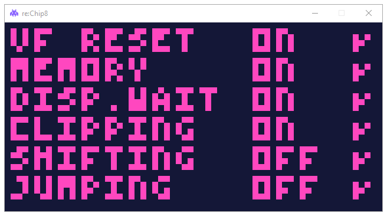

<h1 align="center">

 re:Chip8
</h1>

re:Chip8 (Formerly: Lemon.pie), is yet another hobby emulator for the classic variant of the CHIP-8 Virtual Machine written in Python. It's just a toy emulator with no exclusive features that I made solely for my own learning experience. Although I think it's fine for some casual gameplay, I don't really recommend using it for any sort of serious tasks, especially if the task relies on timing accuracy because the timing is really broken!

### Installation & Usage:

Simply install the re:Chip8 emulator (rechip8) from PYPI using the command:

`pip install rechip8`

Now, run the emulator in a Command Line Terminal using `python3 -m rechip8 path_to_rom`

Optionally, you can also scale up the window size using the SCALE option (-S SCALE, --scale SCALE), like so:

`python3 -m rechip8 path_to_rom -S scale_int`

### Test Results:
*tested with chip8-test-suite's ver. 4.1*

- **Chip8 Test Suite's Logo**:

- **IBM Logo**:

- **Corax Test**:

- **Flags Test**:

- **Quirks Test**:

- **Keypad Halt Test**:

- **Beep Test**:

<video src="./vid/7-beep.mp4" width="640" height="480" controls></video>

### Acknowledgements
Thanks to...

- [Cowgod's Chip-8 Technical Reference](http://devernay.free.fr/hacks/chip8/C8TECH10.HTM).
- [Tobias V. Langhoff](https://tobiasvl.github.io/) for the incredible [guide](https://tobiasvl.github.io/blog/write-a-chip-8-emulator/).
- [Timendus](https://github.com/Timendus) for the amazing [test suite](https://github.com/Timendus/chip8-test-suite).
- The [r/emu](https://www.reddit.com/r/emulation/) community.
