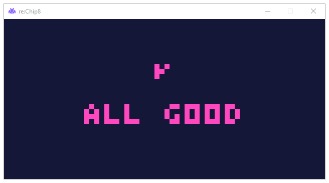

<h1 align="center">

 Lemon.pie
</h1>

Lemon is a **[CHIP-8](https://en.wikipedia.org/wiki/CHIP-8)** Emulator written in Python using Pygame.
This library aims at implementing the original and classic varient of CHIP-8 Virtual Machine. It is a toy just for my own learning experience and is in no way suitable for any
type of research for the original VM.

But, i have to say that it was really fun writing this emulator again after so many months!
My last implementation of the VM was "Trace-Fractal" that i archived, Lemon can be considered the successor of that project,
an attempt to make the codebase a tad bit more clean.

### Progress (So Far...):
So far, i have completed almost 90% of the emulator though there are a few things that are still
needed to be fixed:

- ~Clipping Quirk~ *Fixed in 1.1.0*

- Disp.wait Quirk

- ~Keypad Not Halting Bug~ *Fixed in 1.1.0*

Since i am going for classic CHIP-8 varient, i have to implement those quriks to match
original CHIP-8 behaviour.

### Test Results:
(tested with chip8-test-suite's ver 4.0)

**Chip8 Test Suite's logo**:

**IBM Logo**:

**Corax Test**:

**Flags Test**:

**Quirks Test**:

**Keypad Halt Test**:

### Future Ahead:

I have decided to make an assembler and disassembler for this project as well and
eventually emulate other consoles like Gameboy and NES.

### Acknowledgement
Thanks to...

- [Cowgod's Chip-8 Technical Reference](http://devernay.free.fr/hacks/chip8/C8TECH10.HTM).
- [Tobias V. Langhoff](https://tobiasvl.github.io/) for the incredible [guide](https://tobiasvl.github.io/blog/write-a-chip-8-emulator/).
- [Timendus](https://github.com/Timendus) for the amazing [test suite](https://github.com/Timendus/chip8-test-suite).
- The [r/emu](https://www.reddit.com/r/emulation/) community.
